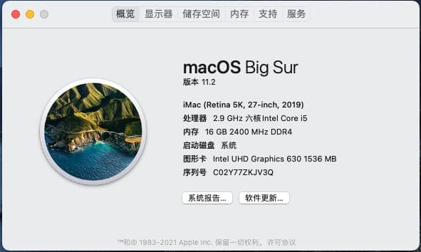

# Intel Hackintosh - Opencore EFI for GIGABYTE H310M H 2.0 i5-9400

## Specification
| **Component** | **Model** |
| ------------- | --------- |
| CPU | I5 9400 |
| Motherboard |GIGABYTE H310M H 2.0 |
| RAM | 16GB (2 x 8GB) |
| Audio Chipset | Realtek® ALC887 |
| GPU | Intel Uhd Graphics 630|
| Ethernet | RTL8111  |
| OS Disk (Sata3) | 240GB |

**OpenCore version**: 0.6.6  
